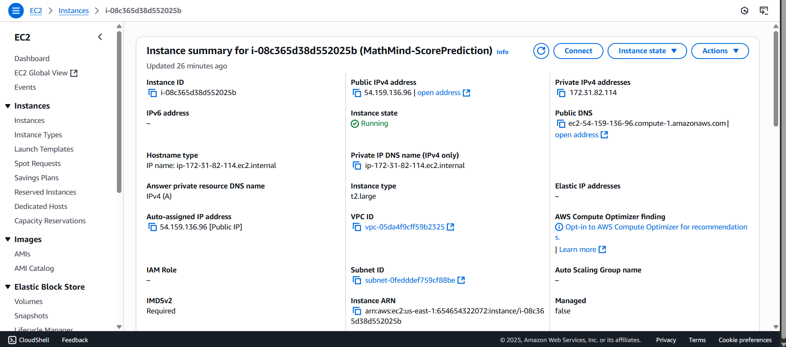
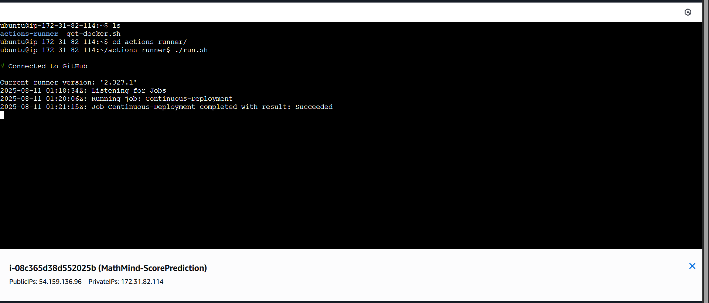
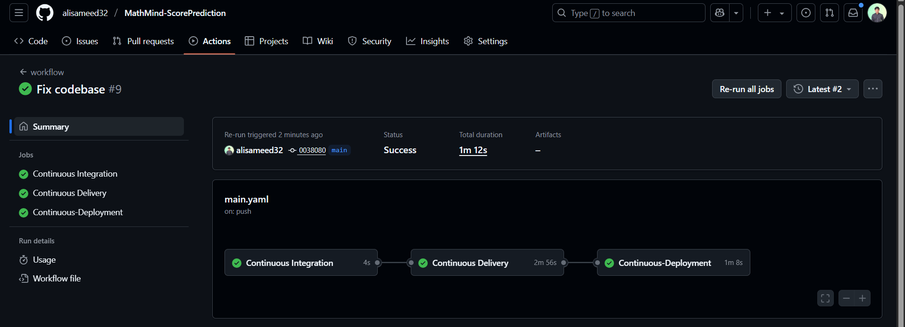

# MathMind-ScorePrediction 🎯

**A Full-Stack, Modular Machine Learning Application with Responsive Frontend, Docker & Cloud Deployment, CI/CD, and Public Docker Hub Distribution**

---
https://github.com/user-attachments/assets/053cc405-2da5-4114-8714-7e8df8aec7e6

---

##  Table of Contents

1. [Abstract](#abstract)  
2. [Introduction](#introduction)  
3. [Objectives](#objectives)  
4. [System Architecture](#system-architecture)  
5. [Project Structure](#project-structure)  
6. [Methodology](#methodology)  
   - [Data Collection & Preprocessing](#data-collection----preprocessing)  
   - [Model Training & Evaluation](#model-training----evaluation)  
   - [Frontend Development](#frontend-development)  
   - [Backend Development](#backend-development)  
7. [Deployment Pipeline](#deployment-pipeline)  
   - [Dockerization](#dockerization)  
   - [AWS ECR & EC2](#aws-ecr----ec2)  
   - [CI/CD with GitHub Actions](#cicd-with-github-actions)  
   - [Docker Hub Distribution](#docker-hub-distribution)  
8. [Results](#results)  
9. [Screenshots & Demo](#screenshots----demo)  
10. [Installation & Usage](#installation----usage)  
11. [Conclusion](#conclusion)  
12. [License](#license)  

---

## 1. Abstract

**MathMind-ScorePrediction** is an end-to-end, modular machine learning application that predicts student's math scores. It includes:  
- Modular programmatic pipeline (ingestion → preprocessing → training → evaluation → prediction)  
- Serialized artifacts: `preprocessor.pkl` and `model.pkl` for reliable deployment  
- A responsive, mobile-friendly frontend (HTML/CSS with Gemini CLI enhancements)  
- Flask backend for serving predictions  
- Dockerized deployment, available via **AWS ECR** (for production) and **Docker Hub** (for public access)  
- Automated CI/CD with GitHub Actions

 

---

## 2. Introduction

Predicting student performance can inform educational interventions. The MathMind-ScorePrediction pipeline applies machine learning to student data, wrapped in a clean UI and deployed to the cloud for real-world usability and maintainability.

---

## 3. Objectives

- Achieve **≥ 85% R² score** (achieved 88%)  
- Build with **modular architecture** for scalability and maintainability  
- Serialize both **preprocessor** and **model** as `.pkl` artifacts  
- Provide a **responsive frontend UI**  
- Enable secure deployment via **AWS EC2 & ECR**, plus public access via **Docker Hub**  
- Automate deployments using **GitHub Actions CI/CD**

---

## 4. System Architecture

The system is structured for **portability, scalability, and automation**, combining:

1. **Frontend Layer** – Responsive HTML/CSS interface  
2. **Backend Layer** – Flask API integrating `preprocessor.pkl` and `model.pkl`  
3. **ML Pipeline** – Modular ingestion, preprocessing, training, evaluation, and prediction  
4. **Infrastructure Layer** – Docker, AWS ECR, EC2, and Docker Hub distribution


---

### Workflow Summary

- **User Interaction**: Provides input via frontend  
- **Backend Processing**: Transforms input with `preprocessor.pkl`, infers via `model.pkl`, returns prediction  
- **Deployment Workflow**: Packaged as a single Docker image and managed across environments

---

### Why Docker?

The Dockerized image encapsulates all components—code, pickled artifacts, and dependencies—ensuring consistent behavior, rapid deployment, and easy version control.


---

### AWS & Docker Hub

- **AWS ECR**: Private container registry for EC2 deployment  
- **AWS EC2**: Hosts the running container in production (pulls from ECR)  
- **Docker Hub**: Public registry for users to pull and run the app using:

```

docker pull alisameed/mathmind-scoreprediction

````

---

## 5. Project Structure

```plaintext
MathMind-ScorePrediction/
│── .github/             # CI/CD workflows
│── artifacts/           # model.pkl, preprocessor.pkl
│── src/                 # Modular ML pipeline
│── static/              # CSS and assets  
│── templates/           # HTML frontend  
│── notebook/            # EDA and experimentation  
│── app.py                # Flask app  
│── Dockerfile            # Build instructions  
│── requirements.txt      # Dependencies  
│── setup.py              # Package configuration  
│── .dockerignore         # Docker exclusions  
│── .gitignore            # Git exclusions  
````

---

## 6. Methodology

### 6.1 Data Collection & Preprocessing

* Source: Student Performance Indicator dataset
* Steps: Imputation → Encoding → Scaling → Train/Test split
* Output: `preprocessor.pkl` for live inference

---

### 6.2 Model Training & Evaluation

* Evaluated models: Random Forest, XGBoost, CatBoost, Linear Regression
* Best result: **CatBoost Regressor** with an R² score of **88%**
* Output: `model.pkl` for deployment

---

### 6.3 Frontend Development

* Built with HTML5 + CSS3
* Styled via Gemini CLI for modern, minimalistic UI
* Pages include onboarding, form submission


---

### 6.4 Backend Development

* Flask-based API (`app.py`)
* Works with both pickled artifacts (`preprocessor.pkl`, `model.pkl`)
* Clean separation of modules in the pipeline for maintainability

---

## 7. Deployment Pipeline

### 7.1 Dockerization

* **Dockerfile** builds the complete image including app, models, and static assets
* `.dockerignore` is used to limit image size by excluding unnecessary files

---

### 7.2 AWS ECR & EC2

* ECR stores the Docker image securely
* EC2 pulls the latest image to deploy the app in production

 
---

### 7.3 CI/CD with GitHub Actions

Deployment flow:

1. Code pushed to `main` triggers build
2. Docker image is built
3. Pushed to **AWS ECR**
4. EC2 instance pulls and redeploys via GitHub Actions
    
---

### 7.4 Docker Hub Distribution

The Docker image is publicly available at:

* Command:

  ```bash
  docker pull alisameed/mathmind-scoreprediction
  ```
* Docker Hub: [alisameed/mathmind-scoreprediction](https://hub.docker.com/r/alisameed/mathmind-scoreprediction)

---

## 8. Results

* **88% R² score** from the CatBoost model
* Fully modular pipeline with reusable `preprocessor.pkl` & `model.pkl`
* Responsive frontend and scalable backend architecture
* Deployed on AWS EC2 with both ECR and public Docker Hub availability

---

## 9. Screenshots & Demo

### Desktop View


### Mobile View


---

## 10. Installation & Usage

```bash
# Pull from Docker Hub
docker pull alisameed/mathmind-scoreprediction
docker run -p 5000:5000 alisameed/mathmind-scoreprediction

# Alternatively, run locally
git clone https://github.com/alisameed32/MathMind-ScorePrediction.git
cd MathMind-ScorePrediction
python -m venv venv
source venv/bin/activate  # or venv\Scripts\activate on Windows
pip install -r requirements.txt
python app.py
```

---

## 11. Conclusion

This project delivers a polished, modular ML application with production-grade deployment including:

* Serialized preprocessing and modeling artifacts (`preprocessor.pkl`, `model.pkl`)
* Dockerized distribution through both **AWS ECR** and **Docker Hub**
* CI/CD-driven deployment to a cloud-hosted EC2 server
* A front-end that’s both responsive and intuitive

---

## 12. 📬 Contact

If you’d like to connect, collaborate, or have any questions about this project:  

- **GitHub:** [Ali Sameed](https://github.com/alisameed32)  
- **LinkedIn:** [Ali Sameed](https://www.linkedin.com/in/alisameed/)
- **Email:** [alisameed.ds@gmail.com]([alisameed.ds@gmail.com) 
